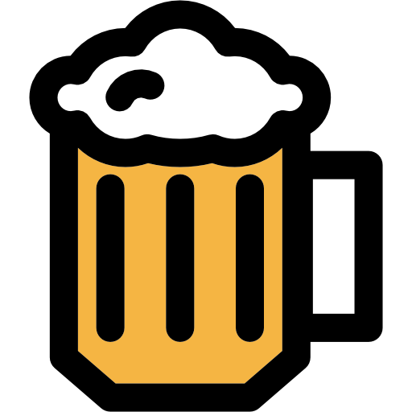
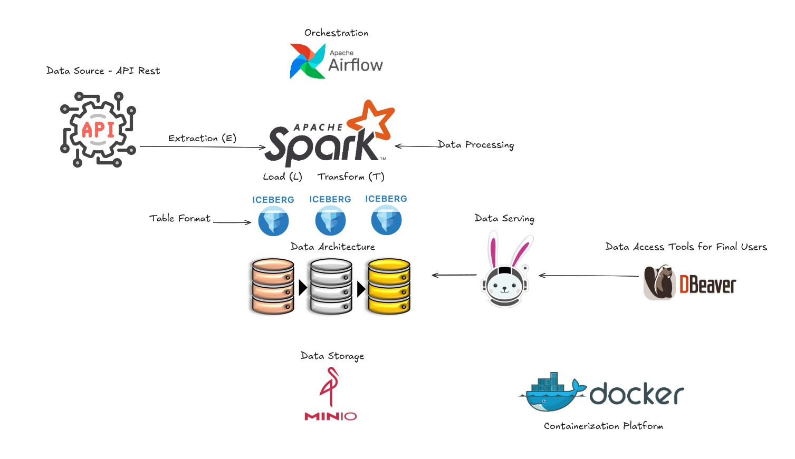
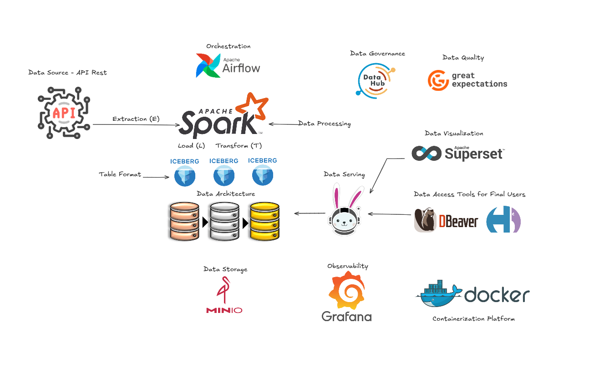

# Breweries Use Case — PoC



Robust, scalable data solution following the **medallion architecture** (Bronze–Silver–Gold) to process **Open Brewery DB** data. The project leverages modern components for orchestration, distributed processing, transactional table format, and interactive querying.

## Architecture

### Overview
- **Data Fabric** on **Lakehouse**
- ACID transactions in table formats
- Scalability and reliability for batch and interactive queries
- Virtualization / unified querying with Trino
- Single source of truth and standardized data layers

## On Going:


## To Be:


### Components
- **Airflow**: workflow orchestration
- **Spark**: distributed processing and job execution
- **Apache Iceberg**: table format for the data lake (ACID)
- **Nessie**: catalog for versioning Iceberg tables
- **MinIO**: S3-compatible storage
- **Trino**: SQL engine for exploration/BI
- **PostgreSQL**: Airflow metastore

### Data layers
- **Bronze**: raw ingestion from the API, minimal transformation
- **Silver**: cleaning, standardization, and validation
- **Gold**: analytical aggregations and business metrics

---

## Prerequisites
- Docker 20.10+
- Docker Compose 2.0+
- Git
- Recommended: 8 GB RAM, 4 vCPUs, 20 GB free disk space

> On Linux/macOS, ensure execution permission: `chmod +x setup.sh`.

---

## Quick start

```bash
# 1) Clone the repository
git clone <repository-URL>
cd breweries_case

# 2) Run the full setup
./setup.sh
```

`setup.sh` automatically:
- builds the images
- brings up the containers
- creates Iceberg namespaces and tables in the Nessie catalog

After it finishes, the interfaces are available at:
- Airflow UI: http://localhost:8080
- Spark Master UI: http://localhost:8081
- Spark History Server: http://localhost:18080
- Trino Web UI: http://localhost:8082
- MinIO Console: http://localhost:9001 (user: `admin`, password: `admin123`)
- Nessie (API): http://localhost:19120

---

## Project structure

```
breweries_case/
├─ docker-compose.yaml
├─ requirements.txt
├─ spark-defaults.conf
├─ setup
│  ├─ setup.sh
│  └─ create_tables_script.py
├─ docker/
│  ├─ airflow/
│  │  └─ Dockerfile.airflow
│  └─ spark/
│     └─ Dockerfile.spark
├─ dags/
│  └─ ... (Airflow DAGs)
├─ src/
│  ├─ config/
│  ├─ processors/
│  └─ utils/
├─ trino/
│  └─ etc/
│     ├─ config.properties
│     └─ catalog/
│        ├─ iceberg.properties
│        └─ memory.properties
├─ scripts/
│  └─ minio-init.sh
└─ docs/
   └─ imgs -> Icons used in this README
```

> Data, events, and log volumes (for example `events/`, `spark-logs/`, `data/`) are created and mounted via `docker-compose.yaml`.

---

## Pipeline operation

### Via Airflow
1. Open **http://localhost:8080** (user: `admin`, password: `admin`)
2. Find the `breweries_data_pipeline` DAG
3. Enable the DAG and trigger a manual run (or wait for the schedule)

### Via Trino (interactive querying)
Example using the CLI inside the Trino container:

```bash
docker exec -it trino trino --server http://localhost:8080 --catalog iceberg

-- Schemas (layers)
SHOW SCHEMAS LIKE '%_layer';

-- Tables by layer
SHOW TABLES FROM iceberg.bronze_layer;
SHOW TABLES FROM iceberg.silver_layer;
SHOW TABLES FROM iceberg.gold_layer;

-- Samples
SELECT * FROM iceberg.silver_layer.tbl_silver_brewery LIMIT 10;
SELECT * FROM iceberg.gold_layer.tbl_gold_brewery_agg LIMIT 10;
```

> If you prefer an external SQL client, configure the endpoint `http://localhost:8082` with the `iceberg` catalog.

---

## Troubleshooting

1) **Containers don’t start**
```bash
docker compose down -v
docker compose up -d
```

2) **Airflow (UID) permissions**
```bash
echo "AIRFLOW_UID=$(id -u)" > .env
docker compose down && docker compose up -d
```

3) **Tables not found**
Re-run table creation after services are up:
```bash
python3 ./create_tables_script.py
```

### Logs & diagnostics
```bash
docker compose logs --tail=200

# Specific services
docker logs airflow-webserver   --tail=200
docker logs airflow-scheduler   --tail=200
docker logs spark-master        --tail=200
docker logs spark-worker-1      --tail=200

# Resources
docker stats
```

---

## Development

- Style: PEP 8/257, type hints, error handling, logging
- Airflow: idempotent tasks, parameters in variables/config files
- PySpark: explicit schemas, coherent partitioning, date handling
- Tests: structure for unit/integration; fixtures for synthetic data
- Quality: linters and pre-commit

Example test structure:
```
tests/
├─ unit/
│  ├─ test_bronze.py
│  ├─ test_silver.py
│  └─ test_gold.py
└─ integration/
   └─ ...
```

---

## Roadmap

- Data purge pipeline (housekeeping routine)
- Great Expectations for Data Quality
- Observability and metrics (Grafana)
- Data Catalog (e.g., DataHub)
- CI/CD (GitHub Actions) with image build/publish
- Schema evolution and change audit
- Performance/load testing
- Evolve infrastructure toward a robust container orchestration environment (Kubernetes)
- Integrate the open-source LLM tool **Ollama** to optimize the insight-extraction process, adding more value in less time and enabling users to explore data using natural language.

---

## License

MIT License

Copyright (c) 2025 Daniel Ferreira da Costa

Permission is hereby granted, free of charge, to any person obtaining a copy
of this software and associated documentation files (the "Software"), to deal
in the Software without restriction, including without limitation the rights
to use, copy, modify, merge, publish, distribute, sublicense, and/or sell
copies of the Software, and to permit persons to whom the Software is
furnished to do so, subject to the following conditions:

The above copyright notice and this permission notice shall be included in all
copies or substantial portions of the Software.

THE SOFTWARE IS PROVIDED "AS IS", WITHOUT WARRANTY OF ANY KIND, EXPRESS OR
IMPLIED, INCLUDING BUT NOT LIMITED TO THE WARRANTIES OF MERCHANTABILITY,
FITNESS FOR A PARTICULAR PURPOSE AND NONINFRINGEMENT. IN NO EVENT SHALL THE
AUTHORS OR COPYRIGHT HOLDERS BE LIABLE FOR ANY CLAIM, DAMAGES OR OTHER
LIABILITY, WHETHER IN AN ACTION OF CONTRACT, TORT OR OTHERWISE, ARISING FROM,
OUT OF OR IN CONNECTION WITH THE SOFTWARE OR THE USE OR OTHER DEALINGS IN THE
SOFTWARE.
