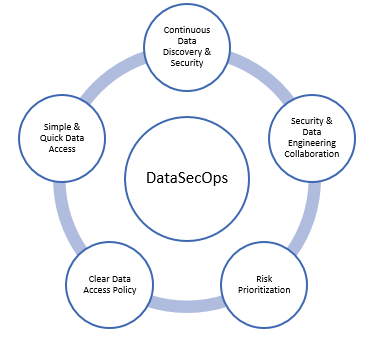

# Breweries Data Pipeline - PoC


Uma solução completa de pipeline de dados seguindo arquitetura medallion (Bronze-Silver-Gold) para processar dados - API Open Brewery DB.

- Uso de modern data stacks e arquitetura robusta de dados

## Arquitetura

### Current Archtecture:

- Data Fabric on Top of a Lakehouse.
- Lakehouse combina o melhor dos 2 mundos: A possibilidade de ter um Data Warehouse em um Data Lake.
- Transações ACID em dados variados de larga escala.
- Integridade, escalabilidade e alta disponibilidade
- Possibilidade de integração facilitada entre diferentes fontes, através da virtualização com o Trino
- Fonte Unica da Verdade

<br>


To be Archtecture:


### Componentes Principais:
- **Airflow**: Orquestração de workflow
- **Spark**: Processamento de dados distribuído
- **Iceberg**: Formato de tabela para data lake
- **MinIO**: Storage S3-compatível 
- **Trino**: Query engine para analytics
- **PostgreSQL**: Metastore do Airflow

### Camadas de Dados (Medallion Architecture):
- **Bronze**: Dados brutos da API com mínima transformação
- **Silver**: Dados limpos, validados e padronizados  
- **Gold**: Agregações analíticas e métricas de negócio

## Instalação e Configuração

### 1. Pré-requisitos

```bash
# Dependências do sistema
- Docker 20.10+
- Docker Compose 2.0+
- Python 3.8+
- Git

# Recursos mínimos recomendados
- 8GB RAM
- 4 CPU cores
- 20GB espaço em disco
```

### 2. Setup do Projeto

```bash
# 1. Clone o repositório
git clone <repository-url>
cd breweries_case

# 2. Crie a estrutura de diretórios
mkdir -p {dags/config, src/{processors,utils},tests/{unit,integration},sql,docker/{spark/airflow}}

# 3. Configure as permissões do Airflow
echo "AIRFLOW_UID=$(id -u)" > .env

# 4. Instale dependências Python (opcional para desenvolvimento)
python -m pip install -r requirements.txt
```

### 3. Configuração dos Schemas/Databases

```bash
# 1. Inicie os containers
docker compose up -d

# 2. Aguarde todos os serviços ficarem prontos (2-3 minutos)
docker ps  # Verifique se todos estão "healthy"

# 3 TODO - Finalizar script para setup inicial do Banco:
* Por enquanto, criar manualmente os databases e tabelas disponíveis em sql/{database/table}

```

### 4. Configuração Manual dos Schemas (alternativa)

Se preferir executar manualmente via terminal - VIA TRINO:

```sql
-- Criar databases
CREATE SCHEMA IF NOT EXISTS iceberg.bronze_layer WITH (location = 's3a://warehouse/bronze/');
CREATE SCHEMA IF NOT EXISTS iceberg.silver_layer WITH (location = 's3a://warehouse/silver/');
CREATE SCHEMA IF NOT EXISTS iceberg.gold_layer WITH (location = 's3a://warehouse/gold/');

-- Verificar criação
SHOW SCHEMAS LIKE '%_layer';
```

## Como Executar os Testes

### 1. Configuração do Ambiente de Testes

```bash
# 1. Instalar dependências de teste
TODO - Finalizar automatização dos testes unitários e end-to-end
```

### 2. Executar Testes Unitários

```bash
# Todos os testes unitários
TODO - Finalizar automatização dos testes unitários e end-to-end

### 3. Estrutura dos Testes


tests/
├── unit/   
│   ├── __init__.py                       
│   ├── test_bronze.py     
│   ├── test_silver.py   
│   └── test_gold.py     
├── integration/                   
│   └── TODO Finalizar
└── TODO Finalizar                   
```

```
## Como Executar o Pipeline

### 1. Via Airflow UI

```bash
# 1. Acesse http://localhost:8080
# Usuário: admin
# Senha: admin

# 2. Encontre a DAG "breweries_data_pipeline"
# 3. Ative a DAG
# 4. Trigger manual ou aguarde schedule
```

### 2. Via Linha de Comando - TODO

```bash
# Trigger manual da DAG completa

# Executar task específica

# Ver status das execuções

```


## Monitoramento e Validação

### 1. Interfaces Web Disponíveis

```bash
# Airflow UI - Orquestração
http://localhost:8080

# Spark Master UI - Cluster Spark  
http://localhost:8081

# Spark History Server - Histórico jobs
http://localhost:18080

# Trino UI - Query engine
http://localhost:8082

# MinIO Console - Storage
http://localhost:9001  # admin/admin123

# Nessie- Iceberg Catalog
http://localhost:19120  # admin
```

### 2. Validação de Dados via Trino

```sql
-- Conectar no Trino
docker exec -it trino trino --server http://localhost:8082 --catalog iceberg --schema bronze_layer

-- Verificar dados Bronze
TODO

-- Verificar dados Silver  
TODO

-- Verificar analytics Gold
TODO

```

### 3. Logs e Debugging

```bash
# Logs do Airflow
docker logs airflow-scheduler | tail -100
docker logs airflow-webserver | tail -100

# Logs do Spark
docker logs spark-master | tail -100  
docker logs spark-worker-1 | tail -100

# Logs específicos de task
docker exec -it airflow-scheduler airflow tasks log breweries_data_pipeline bronze_layer.ingest_brewery_data 2025-01-01
```

## Melhores Práticas Implementadas

### 1. **Código Python**
- ✅ PEP 8, PEP 20, PEP 257 compliance
- ✅ Type hints aplicados na maior parte do código
- ✅ Error handling
- ✅ Documentação detalhada - Em desenvolvmento

### 2. **Arquitetura SOLID**
- ✅ Single Responsibility: Classes focadas
- ✅ Open/Closed: Extensível via herança
- ✅ Liskov Substitution: Interfaces bem definidas
- ✅ Interface Segregation: Interfaces específicas
- ✅ Dependency Injection: Configurações injetáveis

### 3. **PySpark (Palantir Best Practices)**
- ✅ https://github.com/palantir/pyspark-style-guide

### 4. **Airflow (Apache + Astronomer)**
- ✅ Task groups organization
- ✅ SLA monitoring  
- ✅ Error callbacks
- ✅ Configuration externalization
- ✅ Retry strategies

## Qualidade de Dados - TODO

### Métricas à serem implmentadas:
- **Completeness**: % campos preenchidos
- **Validity**: Validação de formatos e ranges
- **Consistency**: Padronização de valores
- **Accuracy**: Validação de coordenadas geográficas
- **Timeliness**: Tracking de freshness dos dados

### Alertas à serem Configurados:
- Pipeline failures
- Data quality drops
- SLA misses  
- Processing time anomalies

## Solução de Problemas

### Problemas Comuns:

1. **Containers não sobem**:
```bash
# Verificar logs
docker compose logs
# Restart clean
docker compose down -v && docker compose up -d
```

2. **Erro de permissões no Airflow**:
```bash
echo "AIRFLOW_UID=$(id -u)" > .env
docker compose down && docker compose up -d
```

3. **Tabelas Iceberg não encontradas**:
```bash
# Re-executar scripts DDL
docker exec -it trino trino --server http://localhost:8082 --catalog iceberg
```

4. **Spark jobs falhando**:
```bash
# Verificar recursos
docker stats
# Verificar logs do Spark
docker logs spark-master
```

## TODO / Minset DataSecOps

- Mindset voltado aos principais pilares de um bom aculturamento de dados
- Entrega de valor, respeitando fundamentos essenciais como a segurança.
- Aculturamento
- Foco em entregas ágeis, garantindo qualidade, segurança e alta disponibilidade

<br>



## TODO - Melhorias Futuras

- [ ] Implementar Great Expectations para Data Quality
- [ ] Adicionar Datahub para Data Catalog
- [ ] Integração com Grafana para observabilidade da aplicação
- [ ] CI/CD pipeline com GitHub Actions
- [ ] Testes de performance e load testing
- [ ] Data versioning com DVC
- [ ] Schema evolution automation
- [ ] Conclusão, elaboração e melhoria da documentação.

## TODO / IA Para Empoderar

- [ ] Utilizar técnicas de RAG com LLM Open-Source Ollama, para extrair insights valiosos a partir do uso de linguagem natural

<br>

  
